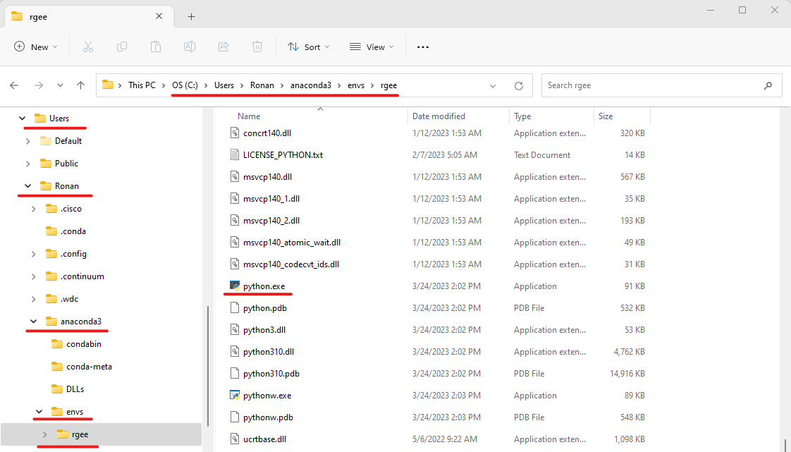

# Connecting R to Earth Engine

Now that we have Python and the Earth Engine API installed and connected to our Google credentials, we now have to connect R to Python and the API

Open up Rstudio. If you haven't already, install `rgee`

```{r}
install.packages("rgee")
```

## Connecting R to Python

`rgee` is dependent on a package called `reticulate` (which is automatically installed when you install `rgee`). `reticulate` is what lets R talk to Python, thus letting R talk to Google Earth Engine. 

First, we have to set up a path to where R can find a python.exe file. We *could* use `Sys.which` to find where python.exe is located...

```{r, eval = T}
Sys.which("python")
```

**HOWEVER!** We need to be sure that this python executable file has the Earth Engine API connected to it. Remember all that work we did in the previous chapter? We created a conda environment specifically for `rgee` and installed the API in it. There is also a python.exe file within this environment, so we want R to work with this file. 

```{r, eval = T}
# note that you will need to change the user name for your case
python_dir <- "C:\\Users\\Ronan\\anaconda3\\envs\\"
rgee_env <- paste0(python_dir, "rgee\\")
python_exe <- paste0(rgee_env, "python.exe")
python_exe
file.exists(python_exe)
```

*(Note: this would also work with* `/` *instead of* `\\`*)*

If, for whatever reason, the `rgee` environment we created in the last chapter is in a different location than mine (other than the user name) and you aren't sure where it would be located, you can search for it within your file explorer

{#id .class width=85% height=85%}
Let's tell R to use this Python file

```{r, eval = T}
reticulate::use_python(python_exe)
```

## Connecting `rgee` to the Python Environment

Now we need to connect `rgee` with the Python environment we created in the previous chapter. We could use the default `rgee::ee_install`, however, this creates a *new* environment. If we did this, this new environment would not have the Earth Engine API connected to it. Instead, we will use `rgee::ee_ee_install_set_pyenv` to specify an existing Python environment

```{r, eval = T}
rgee::ee_install_set_pyenv(py_path = rgee_env, py_env = "rgee")
```
You will be asked to restart your R session. Enter `1` for yes. 

## Initializing GEE

Now we have to authenticate and connect `rgee` with the Google account you use for Google Earth Engine.

```{r}
rgee::ee_check()
```

